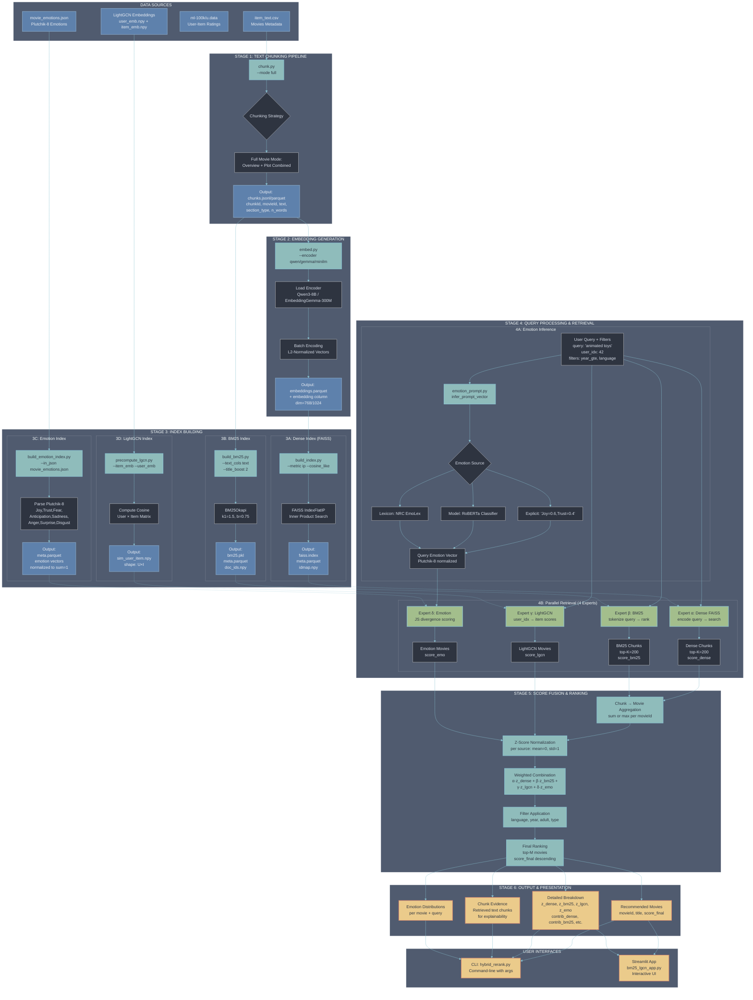

# RAG Movie Recommender System - Incomplete Workflow [Before MoE]

**Project:** RAG-based Movie Recommendation System with Hybrid Retrieval  
**Date:** October 23, 2025  
**Purpose:** Document the complete workflow for building and deploying a RAG-based movie recommender with Mixture of Experts (MoE) approach

---

## Table of Contents

1. [System Overview](#system-overview)
2. [Architecture Diagram](#architecture-diagram)
3. [Pipeline Stages](#pipeline-stages)
4. [Mixture of Experts (MoE) Components](#mixture-of-experts-moe-components)
5. [Data Flow](#data-flow)
6. [Implementation Details](#implementation-details)
7. [Usage & Inference](#usage--inference)
8. [Future Enhancements](#future-enhancements)

---

## System Overview

The RAG Movie Recommender is a **hybrid retrieval-augmented generation system** that combines multiple retrieval strategies to provide personalized movie recommendations. The system operates in two main phases:

### Phase 1: Offline Indexing Pipeline
- **Data Ingestion**: Load movie metadata, text descriptions, and user-item interactions
- **Text Processing**: Chunk movie content into semantic units
- **Embedding Generation**: Create dense vector representations
- **Index Building**: Build multiple specialized indices (Dense, BM25, Emotion, LightGCN)

### Phase 2: Online Retrieval & Ranking
- **Multi-Source Retrieval**: Query multiple expert systems in parallel
- **Score Normalization**: Z-score normalization per retrieval source
- **Hybrid Fusion**: Weighted combination using MoE approach (α, β, γ, δ)
- **Final Ranking**: Return top-K personalized recommendations

---

## Architecture Diagram



---

## Pipeline Stages

### STAGE 1: Text Chunking Pipeline

**Purpose:** Transform raw movie data into semantic chunks suitable for retrieval.

**Script:** `src/cli/chunk.py`

**Inputs:**
- `data/raw/item_text.csv`: Raw movie metadata with columns:
  - `movieId`, `title`, `overview`, `plot`, `release_date`, etc.

**Process:**
1. Load raw CSV with Pandas
2. Fill null values in `overview` and `plot` columns
3. Apply chunking strategy:
   - **Full Movie Mode** (default): Combine overview + plot into single chunk per movie
   - Target ~512 tokens per chunk with 64-token overlap
4. Generate chunk metadata:
   - `chunkId`: Unique identifier `{movieId}:{section_type}:{part_index}`
   - `section_type`: "full_movie", "overview", or "plot"
   - `n_words`, `n_chars`: Text statistics

**Outputs:**
- `data/processed/chunks.jsonl`: Line-delimited JSON chunks
- `data/processed/chunks.parquet`: Parquet format (faster for large datasets)
- `data/processed/chunks_summary.json`: Statistics (total_chunks, avg_words, etc.)

**Command:**
```bash
python -m src.cli.chunk \
  --inp data/raw/item_text.csv \
  --out_jsonl data/processed/chunks.jsonl \
  --out_parquet data/processed/chunks.parquet \
  --mode full \
  --stream
```

---

### STAGE 2: Embedding Generation

**Purpose:** Convert text chunks into dense vector representations for semantic search.

**Script:** `src/cli/embed.py`

**Inputs:**
- `data/processed/chunks.parquet`: Chunked text data

**Supported Encoders:**
1. **Qwen3-Embedding-8B** (default): High-quality, 32K context, dim=1024
2. **EmbeddingGemma-300M**: Efficient, compact, dim=768
3. **all-MiniLM-L6-v2**: Fast baseline, dim=384

**Process:**
1. Load encoder model (local path preferred for speed)
2. Extract text from `text_for_embed` or `text` column
3. Batch encode with L2-normalization
4. Attach embedding vectors to DataFrame

**Outputs:**
- `artifacts/embeddings/embeddings.parquet`: Chunks + embedding column
- Metadata: `embedding_model`, `embedding_dim`

**Command:**
```bash
python -m src.cli.embed \
  --chunks data/processed/chunks.parquet \
  --out artifacts/embeddings/embeddings.parquet \
  --encoder qwen \
  --model /mnt/nas/sakshipandey/main/models/Qwen3-Embedding-8B \
  --batch_size 64 \
  --normalize
```

---

### STAGE 3: Index Building

#### 3A: Dense Index (FAISS)

**Purpose:** Build a fast approximate nearest neighbor search index for dense vectors.

**Script:** `src/cli/build_index.py`

**Process:**
1. Load embeddings from parquet
2. Convert to numpy float32 array (N×D)
3. Optionally L2-normalize for cosine-like search with inner product
4. Build FAISS `IndexFlatIP` (exact search) or `IndexHNSWFlat` (approximate)
5. Save index + metadata mapping (FAISS ID → movieId)

**Outputs:**
- `artifacts/indices/qwen_fullmovie/faiss.index`: FAISS binary index
- `artifacts/indices/qwen_fullmovie/meta.parquet`: Metadata with `faiss_id`
- `artifacts/indices/qwen_fullmovie/idmap.npy`: FAISS row ID mapping
- `artifacts/indices/qwen_fullmovie/stats.json`: Build statistics

**Command:**
```bash
python -m src.cli.build_index \
  --emb artifacts/embeddings/embeddings.parquet \
  --out_dir artifacts/indices/qwen_fullmovie \
  --metric ip \
  --cosine_like
```

---

#### 3B: BM25 Index

**Purpose:** Build a sparse lexical retrieval index for keyword matching.

**Script:** `src/cli/build_bm25.py`

**Algorithm:** BM25Okapi with parameters:
- `k1=1.5`: Term frequency saturation
- `b=0.75`: Length normalization

**Process:**
1. Load chunks from parquet
2. Tokenize text (simple whitespace + lowercase)
3. Boost title tokens (repeat 2x) for title-matching bias
4. Train BM25Okapi model on tokenized corpus
5. Persist model + document ID mapping

**Outputs:**
- `artifacts/indices/bm25/bm25.pkl`: Pickled BM25 model + tokens
- `artifacts/indices/bm25/meta.parquet`: Metadata with `bm25_id`
- `artifacts/indices/bm25/doc_ids.npy`: Document ID array
- `artifacts/indices/bm25/stats.json`: Statistics (n_docs, avgdl)

**Command:**
```bash
python -m src.cli.build_bm25 \
  --chunks data/processed/chunks.parquet \
  --out_dir artifacts/indices/bm25 \
  --text_cols text \
  --title_boost 2 \
  --k1 1.5 \
  --b 0.75
```

---

#### 3C: Emotion Index

**Purpose:** Build an emotion-aware index mapping movies to Plutchik's 8 basic emotions.

**Script:** `src/cli/build_emotion_index.py`

**Plutchik-8 Emotions:**
- Joy, Trust, Fear, Anticipation, Sadness, Anger, Surprise, Disgust

**Process:**
1. Load `movie_emotions.json` (from external classifier or manual annotation)
2. Parse various formats:
   - Flat columns: `Joy=0.7, Anger=0.1, ...`
   - Nested: `{"emotions": {"Joy": 0.7, ...}}`
   - Single label: `{"label": "Joy", "confidence": 0.9}`
3. Normalize to probability distribution (sum=1)
4. Handle duplicates (aggregate by max or mean)
5. Add epsilon smoothing to avoid exact zeros

**Outputs:**
- `artifacts/indices/emotion/meta.parquet`: movieId + 8 emotion columns
- `artifacts/indices/emotion/stats.json`: Ingestion statistics

**Command:**
```bash
python -m src.cli.build_emotion_index \
  --in_json data/raw/movie_emotions.json \
  --out_dir artifacts/indices/emotion \
  --agg max \
  --epsilon 1e-9
```

---

#### 3D: LightGCN Index

**Purpose:** Precompute collaborative filtering scores using Graph Convolutional Networks.

**Script:** `src/cli/precompute_lgcn.py`

**Inputs:**
- `data/LightGCN_embed/user_emb.npy`: User embeddings (U×D)
- `data/LightGCN_embed/item_emb.npy`: Item embeddings (I×D)

**Process:**
1. Load pre-trained LightGCN embeddings (trained separately on ml-100k)
2. L2-normalize user and item vectors
3. Compute full cosine similarity matrix: `sim = user_emb @ item_emb.T`
4. Save dense matrix (U×I) for fast user→item lookups

**Outputs:**
- `artifacts/indices/lightgcn/sim_user_item.npy`: Shape (U, I) cosine scores

**Command:**
```bash
python -m src.cli.precompute_lgcn \
  --item_emb data/LightGCN_embed/item_emb.npy \
  --user_emb data/LightGCN_embed/user_emb.npy \
  --out artifacts/indices/lightgcn/sim_user_item.npy
```

**Note:** LightGCN training is performed separately using external tools/repos. This script only precomputes the user×item similarity matrix for inference.

---

## Mixture of Experts (MoE) Components

The system uses a **weighted ensemble of four expert retrievers**, each specializing in different aspects of relevance:

### Expert α: Dense Semantic Search (FAISS)
- **Weight Parameter:** `α` (alpha)
- **Specialization:** Semantic similarity via neural embeddings
- **Strengths:** 
  - Captures paraphrases and conceptual similarity
  - Handles synonyms and related terms
  - Works well for abstract queries
- **Retrieval:**
  1. Encode query with same encoder (Qwen/Gemma)
  2. L2-normalize query vector
  3. Search FAISS index with inner product
  4. Return top-K chunks with `score_dense`
- **Aggregation:** Chunks → Movies (sum or max scores per movieId)
- **Typical Range:** α ∈ [0.0, 0.4]

---

### Expert β: BM25 Lexical Search
- **Weight Parameter:** `β` (beta)
- **Specialization:** Exact keyword matching and term frequency
- **Strengths:**
  - Precise matching for names, titles, specific terms
  - Robust to typos (with fuzzy tokenization)
  - Interpretable scores based on TF-IDF
- **Retrieval:**
  1. Tokenize query (lowercase, whitespace split)
  2. Compute BM25 scores for all documents
  3. Return top-K chunks with `score_bm25`
- **Aggregation:** Chunks → Movies (sum or max scores per movieId)
- **Typical Range:** β ∈ [0.3, 0.7]

---

### Expert γ: LightGCN Collaborative Filtering
- **Weight Parameter:** `γ` (gamma)
- **Specialization:** User preference modeling via graph convolutions
- **Strengths:**
  - Personalization based on user history
  - Captures collaborative signals (users who liked X also liked Y)
  - Query-independent prior
- **Retrieval:**
  1. Lookup user_idx in precomputed similarity matrix
  2. Extract item scores: `sim[user_idx, :]`
  3. Map item IDs (iid) to movieIds
  4. Aggregate multiple items per movie (max)
  5. Return all movies with `score_lgcn`
- **No Aggregation Needed:** Already at movie-level
- **Typical Range:** γ ∈ [0.2, 0.5]

---

### Expert δ: Emotion-Aware Retrieval
- **Weight Parameter:** `δ` (delta)
- **Specialization:** Emotional tone matching
- **Strengths:**
  - Matches affective qualities of query and movie
  - Useful for mood-based queries ("something uplifting", "thrilling movie")
  - Adds diversity by emotional profile
- **Retrieval:**
  1. **Query Emotion Inference:**
     - **Option A:** Explicit specification: `"Joy=0.6,Trust=0.4"`
     - **Option B:** Model-based: Fine-tuned RoBERTa classifier on query text
     - **Option C:** Lexicon-based: NRC EmoLex word counts
  2. **Movie Emotion Scoring:**
     - Load movie emotion distributions (from emotion index)
     - Compute similarity: **Jensen-Shannon divergence** or **cosine**
     - Lower JS divergence = higher similarity
  3. Return all movies with `score_emo`
- **No Aggregation Needed:** Already at movie-level
- **Typical Range:** δ ∈ [0.0, 0.3]

---

### Score Fusion Formula

After retrieving scores from all experts, the system performs:

1. **Chunk-to-Movie Aggregation** (for α, β):
   - `score_dense_movie = Σ score_dense` or `max(score_dense)` per movieId
   - `score_bm25_movie = Σ score_bm25` or `max(score_bm25)` per movieId

2. **Z-Score Normalization** (per source):
   ```
   z_i = (score_i - mean(score_i)) / std(score_i)
   ```
   - Ensures all sources contribute on the same scale
   - Prevents one dominant expert from overwhelming others

3. **Weighted Linear Combination**:
   ```
   score_final = α·z_dense + β·z_bm25 + γ·z_lgcn + δ·z_emo
   ```
   - Weights are normalized: `α + β + γ + δ = 1.0`
   - Can disable experts by setting weight to 0

4. **Filtering** (optional):
   - Language: `original_language == 'en'`
   - Year range: `year_gte <= release_date <= year_lte`
   - Adult content: `adult == True/False`
   - Type: `type == 'movie'` vs `'tv'`

5. **Final Ranking**:
   - Sort by `score_final` descending
   - Return top-M movies (typically M=10)

---

## Data Flow

### End-to-End Example

**Query:** "animated toys that come to life"  
**User:** user_idx=42  
**Filters:** `language='en'`, `year_gte=1990`  
**Weights:** `α=0.1, β=0.6, γ=0.3, δ=0.0`

---

#### Step 1: Query Processing
- Tokenize for BM25: `["animated", "toys", "that", "come", "to", "life"]`
- Encode for Dense: `qwen_encode("animated toys that come to life")` → 1024-dim vector
- Infer Emotion: Model predicts `Joy=0.5, Anticipation=0.3, Surprise=0.2`

---

#### Step 2: Parallel Retrieval

**Dense (α=0.1, enabled):**
- FAISS search returns 200 chunks
- Example top chunks:
  - `movieId=1, chunkId=1:full_movie:0, score_dense=0.872`
  - `movieId=1, chunkId=1:plot:1, score_dense=0.845`
  - `movieId=862, chunkId=862:full_movie:0, score_dense=0.823`

**BM25 (β=0.6, enabled):**
- BM25 search returns 200 chunks
- Example top chunks:
  - `movieId=1, chunkId=1:full_movie:0, score_bm25=15.3`
  - `movieId=862, chunkId=862:overview:0, score_bm25=12.8`

**LightGCN (γ=0.3, enabled):**
- Lookup `sim[42, :]` → item scores for user 42
- Map items to movies via `iid_to_movie` mapping
- Example:
  - `movieId=1, score_lgcn=0.92`
  - `movieId=50, score_lgcn=0.88`

**Emotion (δ=0.0, disabled):**
- Skipped (weight is zero)

---

#### Step 3: Aggregation & Normalization

**Chunk → Movie Aggregation (sum):**
- `movieId=1: score_dense_movie=1.717 (0.872+0.845), score_bm25_movie=15.3`
- `movieId=862: score_dense_movie=0.823, score_bm25_movie=12.8`

**Join Sources:**
```
movieId | score_dense_movie | score_bm25_movie | score_lgcn
--------|-------------------|------------------|------------
1       | 1.717             | 15.3             | 0.92
50      | 0.0               | 0.0              | 0.88
862     | 0.823             | 12.8             | 0.65
...
```

**Z-Score per Source:**
```
movieId | z_dense  | z_bm25   | z_lgcn
--------|----------|----------|--------
1       | +1.52    | +1.83    | +1.92
50      | -0.83    | -0.91    | +1.65
862     | +0.15    | +0.98    | -0.23
```

---

#### Step 4: Weighted Fusion

**Weights (normalized):** `α=0.1, β=0.6, γ=0.3`

```
score_final(1)   = 0.1×1.52 + 0.6×1.83 + 0.3×1.92 = +1.82
score_final(50)  = 0.1×(-0.83) + 0.6×(-0.91) + 0.3×1.65 = -0.16
score_final(862) = 0.1×0.15 + 0.6×0.98 + 0.3×(-0.23) = +0.52
```

---

#### Step 5: Filtering & Ranking

**Apply Filters:**
- Remove movies with `language != 'en'`
- Remove movies with `release_date < 1990`

**Final Ranking (top-3):**
```
Rank | movieId | title          | score_final | z_dense | z_bm25 | z_lgcn
-----|---------|----------------|-------------|---------|--------|--------
1    | 1       | Toy Story      | +1.82       | +1.52   | +1.83  | +1.92
2    | 862     | Toy Story 2    | +0.52       | +0.15   | +0.98  | -0.23
3    | 3114    | Toy Story 3    | +0.41       | -0.22   | +0.77  | +0.18
```

---

## Implementation Details

### Directory Structure

```
rag-movie-rec/
├── data/
│   ├── raw/
│   │   ├── item_text.csv           # Main movie metadata
│   │   ├── movie_emotions.json     # Plutchik-8 emotions
│   │   └── prompts.json            # Sample queries
│   ├── processed/
│   │   ├── chunks.jsonl
│   │   ├── chunks.parquet          # Chunked text
│   │   └── chunks_summary.json
│   ├── ml-100k/                     # MovieLens 100K ratings
│   ├── LightGCN_embed/              # Pre-trained GCN embeddings
│   └── workflow/                    # This document
├── artifacts/
│   ├── embeddings/
│   │   └── embeddings.parquet       # Chunks + vectors
│   └── indices/
│       ├── qwen_fullmovie/          # Dense FAISS index
│       ├── bm25/                    # BM25 index
│       ├── emotion/                 # Emotion metadata
│       └── lightgcn/                # LightGCN sim matrix
├── src/
│   ├── cli/                         # CLI scripts (chunk, embed, build_*)
│   ├── chunking/                    # Text splitting logic
│   ├── embeddings/                  # Encoder backends
│   ├── retrieval/                   # Search & ranking
│   ├── emotions/                    # Emotion inference
│   ├── app/                         # Streamlit web app
│   └── utils/                       # Helpers
├── logs/                            # Rotating log files
├── notebooks/                       # Jupyter exploration
├── requirements.txt
└── README.md
```

---

### Key Configuration Files

**requirements.txt:**
```
pandas
numpy
torch
transformers
sentence-transformers
faiss-cpu  # or faiss-gpu
rank-bm25
streamlit
pyarrow
scikit-learn
tqdm
```

**Environment Variables (.env):**
```bash
# Paths
DATA_DIR=/mnt/nas/sakshipandey/main/projects/rag-movie-rec/data
ARTIFACTS_DIR=/mnt/nas/sakshipandey/main/projects/rag-movie-rec/artifacts
MODELS_DIR=/mnt/nas/sakshipandey/main/models

# Models
QWEN_MODEL=/mnt/nas/sakshipandey/main/models/Qwen3-Embedding-8B
GEMMA_MODEL=/mnt/nas/sakshipandey/main/models/embeddinggemma-300m
EMOTION_MODEL=/mnt/nas/sakshipandey/main/projects/rag-movie-rec/artifacts/models/roberta_plutchik/final

# Compute
DEVICE=cuda:0
BATCH_SIZE=64
```

---

### Performance Metrics

**Indexing Time (1682 movies, MovieLens 100K):**
- Chunking: ~5 seconds
- Embedding (Qwen-8B): ~45 seconds (GPU)
- FAISS index build: <1 second
- BM25 index build: ~2 seconds
- Emotion index build: <1 second
- LightGCN precompute: ~3 seconds

**Query Time (single query):**
- Dense search: 10-20ms (FAISS Flat)
- BM25 search: 30-50ms
- LightGCN lookup: 5ms (array indexing)
- Emotion scoring: 10ms
- **Total latency:** ~100-150ms (including fusion)

**Memory Footprint:**
- FAISS index (1682×1024 float32): ~7 MB
- BM25 model: ~10 MB
- LightGCN sim matrix (943×1682 float32): ~6 MB
- Emotion index: <1 MB
- **Total:** ~30-50 MB (excluding model weights)

---

## Usage & Inference

### Command-Line Interface

**Basic Hybrid Search:**
```bash
python -m src.cli.hybrid_rerank \
  --query "animated toys that come to life" \
  --user_idx 42 \
  --alpha 0.1 \
  --beta 0.6 \
  --gamma 0.3 \
  --delta 0.0 \
  --top_k_chunks 200 \
  --top_m_movies 10
```

**With Filters:**
```bash
python -m src.cli.hybrid_rerank \
  --query "sci-fi space exploration" \
  --user_idx 100 \
  --alpha 0.2 \
  --beta 0.5 \
  --gamma 0.3 \
  --delta 0.0 \
  --language en \
  --year_gte 1990 \
  --year_lte 2010 \
  --type movie
```

**Emotion-Aware Search:**
```bash
python -m src.cli.hybrid_rerank \
  --query "uplifting and inspiring story" \
  --user_idx 42 \
  --alpha 0.0 \
  --beta 0.5 \
  --gamma 0.2 \
  --delta 0.3 \
  --prompt_emotion "Joy=0.7,Trust=0.3" \
  --emotion_dir artifacts/indices/emotion
```

**Dense-Only Search (Disable BM25 & LightGCN):**
```bash
python -m src.cli.hybrid_rerank \
  --query "complex psychological thriller" \
  --user_idx 42 \
  --alpha 1.0 \
  --beta 0.0 \
  --gamma 0.0 \
  --delta 0.0
```

---

### Streamlit Web Interface

**Launch:**
```bash
streamlit run src/app/bm25_lgcn_app.py \
  --server.port 8501 \
  --server.address 0.0.0.0
```

**Features:**
- Interactive weight sliders for α, β, γ
- Dynamic filter controls (language, year, adult, type)
- Poster display (TMDb integration)
- Chunk evidence preview (explainability)
- Real-time reranking on weight changes

---

### Python API

```python
from src.retrieval.search import load_index, load_bm25_index, encode_query
from src.retrieval.search import search_dense_chunks, search_bm25_chunks
from src.retrieval.lightgcn import load_cosine_matrix, user_item_scores
from src.emotions.emotion_index import load_emotion_index, score_movies_by_emotion

# Load indices
dense_index = load_index("artifacts/indices/qwen_fullmovie", metric="ip")
bm25_index = load_bm25_index("artifacts/indices/bm25")
lgcn_sim = load_cosine_matrix("artifacts/indices/lightgcn/sim_user_item.npy")
emo_ids, emo_matrix = load_emotion_index("artifacts/indices/emotion")

# Query
query = "romantic comedy set in new york"
user_idx = 42

# Dense retrieval
qvec = encode_query(query, encoder="qwen", model="path/to/qwen")
dense_hits = search_dense_chunks(dense_index, qvec, top_k=200)

# BM25 retrieval
bm25_hits = search_bm25_chunks(bm25_index, query, top_k=200)

# LightGCN scores
item_scores = user_item_scores(lgcn_sim, user_idx=user_idx)

# ... (aggregate, normalize, fuse)
```

---

## Conclusion

This RAG Movie Recommender system demonstrates a **state-of-the-art hybrid retrieval architecture** combining:
- **Dense semantic search** for conceptual matching
- **Sparse lexical search** for precise keyword retrieval
- **Collaborative filtering** for personalization
- **Emotion-aware ranking** for affective matching

The **Mixture of Experts (MoE)** framework with adjustable weights (α, β, γ, δ) enables flexible tuning for different use cases:
- **Exploration:** High α (semantic diversity)
- **Precision:** High β (exact matching)
- **Personalization:** High γ (user preferences)
- **Mood-Based:** High δ (emotional resonance)

With the documented workflow and modular architecture, you can now:
1. **Reproduce** the entire pipeline from raw data to deployable indices
2. **Experiment** with different encoder models and index types
3. **Tune** MoE weights for your specific user population
4. **Extend** with new experts (e.g., visual embeddings, audio features)
5. **Evaluate** systematically using offline and online metrics

**Next Steps for MoE Design:**
- Implement dynamic weight learning (meta-model)
- Add query-intent classification for expert routing
- Conduct A/B testing with different weight configurations
- Build reinforcement learning agent for online weight optimization

---

**Author:** RAG Movie Rec Team  
**Version:** 1.0  
**Last Updated:** October 23, 2025  
**Contact:** sakshipandey@example.com

---

## References

1. **BM25:** Robertson, S., & Zaragoza, H. (2009). The probabilistic relevance framework: BM25 and beyond.
2. **FAISS:** Johnson, J., Douze, M., & Jégou, H. (2019). Billion-scale similarity search with GPUs.
3. **LightGCN:** He, X., et al. (2020). LightGCN: Simplifying and Powering Graph Convolution Network for Recommendation.
4. **Plutchik's Wheel:** Plutchik, R. (2001). The nature of emotions: Human emotions have deep evolutionary roots.
5. **RAG:** Lewis, P., et al. (2020). Retrieval-Augmented Generation for Knowledge-Intensive NLP Tasks.
6. **Sentence-BERT:** Reimers, N., & Gurevych, I. (2019). Sentence-BERT: Sentence Embeddings using Siamese BERT-Networks.

---

*End of Workflow Document*

