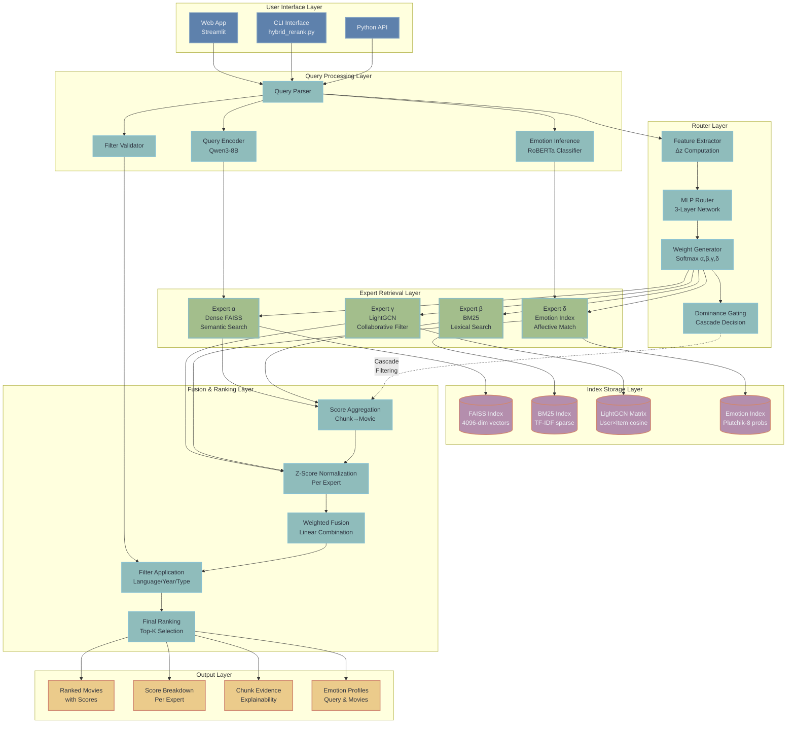
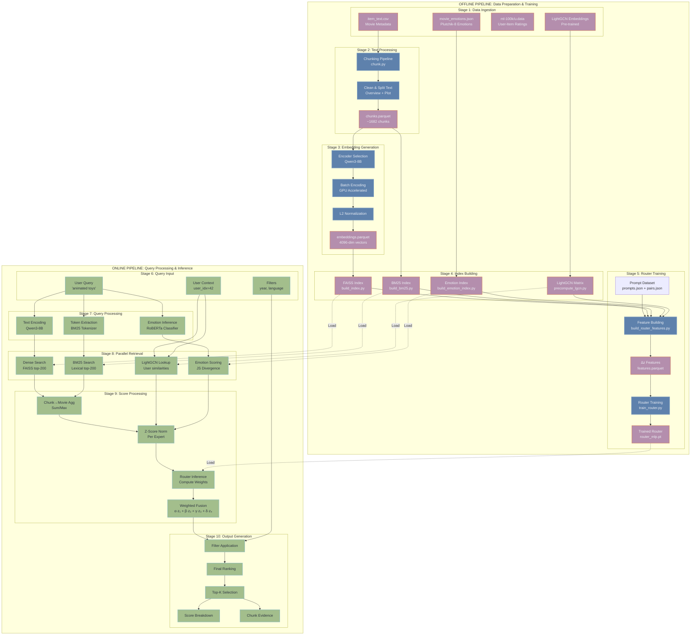

# RAG Movie Recommender System Architecture

## Table of Contents
1. [Overview](#overview)
2. [System Architecture](#system-architecture)
3. [Complete System Workflow](#complete-system-workflow)
4. [Core Components](#core-components)
5. [Expert Systems Deep Dive](#expert-systems-deep-dive)
6. [Router System](#router-system)
7. [Cascade Routing](#cascade-routing)
8. [Training Pipeline](#training-pipeline)
9. [Inference Pipeline](#inference-pipeline)
10. [Performance & Scalability](#performance--scalability)
11. [Future Enhancements](#future-enhancements)

---

## Overview

The RAG Movie Recommender is a sophisticated retrieval-augmented generation system that combines multiple expert retrieval methods with a learned router to provide personalized movie recommendations. The system uses a **Mixture of Experts (MoE)** approach with four specialized retrieval experts and an intelligent router that dynamically weights their contributions based on query characteristics.

### Key Features
- **Multi-Expert Retrieval**: Four complementary retrieval strategies working in parallel
- **Learned Router**: MLP-based router trained on human preferences using Bradley-Terry-Luce loss
- **Cascade Architecture**: 3-layer cascade with dominance gating for efficiency
- **Personalization**: User-aware recommendations via collaborative filtering
- **Emotion-Aware**: Matches emotional tone between queries and movies
- **Explainable**: Provides score breakdowns and chunk evidence

### Design Philosophy
The system is built on the principle that **different queries require different retrieval strategies**:
- Plot-based queries → Dense semantic search
- Title/keyword queries → BM25 lexical matching
- Personalized queries → LightGCN collaborative filtering
- Mood-based queries → Emotion matching

---

## System Architecture

### High-Level Architecture Diagram



---

## Complete System Workflow

### End-to-End Pipeline Visualization



## Core Components

### 1. Data Processing Pipeline

#### 1.1 Data Ingestion
- **Source**: `data/raw/item_text.csv` containing movie metadata
- **Columns**: `movieId`, `title`, `overview`, `plot`, `release_date`, `genres`, etc.
- **Processing**: Text cleaning, normalization, and validation

#### 1.2 Chunking Strategy
- **Approach**: Full-movie chunks (overview + plot combined)
- **Target Size**: ~512 tokens per chunk with 64-token overlap
- **Chunk ID Format**: `{movieId}` (single chunk per movie)
- **Text Processing**: 
  - Clean Wikipedia citations and templates
  - Sentence splitting for long content
  - Metadata preservation

#### 1.3 Embedding Generation
- **Primary Encoder**: Qwen3-Embedding-8B (4096 dimensions)
- **Alternative Encoders**: 
  - EmbeddingGemma-300M (1024 dimensions)
  - all-MiniLM-L6-v2 (384 dimensions)
- **Normalization**: L2-normalized vectors for cosine similarity
- **Window Processing**: Long texts split into overlapping windows

---

## Expert Systems Deep Dive

### Expert Architecture Comparison

```mermaid
graph LR
    subgraph "Expert α: Dense Semantic"
        A1[Query Text] --> A2[Qwen3-8B<br/>Encoder]
        A2 --> A3[4096-dim<br/>Vector]
        A3 --> A4[FAISS<br/>Inner Product]
        A4 --> A5[Top-200<br/>Chunks]
        A5 --> A6[Aggregate<br/>to Movies]
    end
    
    subgraph "Expert β: BM25 Lexical"
        B1[Query Text] --> B2[Tokenizer<br/>Regex Split]
        B2 --> B3[Token List<br/>lowercase]
        B3 --> B4[BM25Okapi<br/>TF-IDF]
        B4 --> B5[Top-200<br/>Chunks]
        B5 --> B6[Aggregate<br/>to Movies]
    end
    
    subgraph "Expert γ: LightGCN CF"
        C1[User Index<br/>user_idx] --> C2[Lookup<br/>Sim Matrix]
        C2 --> C3[User×Item<br/>Cosine Scores]
        C3 --> C4[Map Items<br/>to Movies]
        C4 --> C5[All Movies<br/>with Scores]
    end
    
    subgraph "Expert δ: Emotion Match"
        D1[Query Text] --> D2[RoBERTa<br/>Classifier]
        D2 --> D3[8-dim<br/>Emotion Vector]
        D3 --> D4[JS Divergence<br/>vs Movie Emotions]
        D4 --> D5[All Movies<br/>with Scores]
    end
    
    classDef queryClass fill:#5E81AC,stroke:#81A1C1,stroke-width:2px,color:#ECEFF4
    classDef processClass fill:#8FBCBB,stroke:#88C0D0,stroke-width:2px,color:#2E3440
    classDef outputClass fill:#A3BE8C,stroke:#8FBCBB,stroke-width:2px,color:#2E3440
    
    class A1,B1,C1,D1 queryClass
    class A2,A3,A4,B2,B3,B4,C2,C3,C4,D2,D3,D4 processClass
    class A5,A6,B5,B6,C5,D5 outputClass
```



### 2. Four Expert Retrieval Systems

#### 2.1 Expert α: Dense Semantic Search (FAISS)

**Purpose**: Captures conceptual similarity and semantic understanding through neural embeddings

**Core Technology**: 
- **Encoder**: Qwen3-Embedding-8B (4096 dimensions)
- **Index Type**: FAISS IndexFlatIP (Inner Product)
- **Similarity Metric**: Cosine similarity (via L2-normalized vectors)

**Implementation Details**:
- **Encoding Process**:
  ```python
  # Query encoding with caching
  encoder = load_encoder(encoder="qwen", model=model_path, max_length=8192)
  query_vector = encoder.encode([query_text], normalize=True)[0]  # [4096]
  ```

- **Search Process**:
  ```python
  # FAISS search with oversampling for filtering
  query_vector = query_vector.astype(np.float32)[None, :]  # [1, 4096]
  distances, indices = faiss_index.search(query_vector, k=200)
  
  # Retrieve metadata for chunks
  chunk_hits = meta_df.iloc[indices[0]].copy()
  chunk_hits['score_dense'] = distances[0]
  ```

- **Chunk-to-Movie Aggregation**:
  ```python
  # Sum aggregation (default)
  movie_scores = chunk_hits.groupby('movieId')['score_dense'].sum()
  
  # Or Max aggregation (precision-focused)
  movie_scores = chunk_hits.groupby('movieId')['score_dense'].max()
  ```

**Strengths**: 
- Handles paraphrases and conceptual matches ("robot uprising" ≈ "AI rebellion")
- Captures semantic relationships beyond exact keywords
- Good for plot-based and abstract queries
- Robust to typos and variations

**Weaknesses**:
- May miss exact title matches
- Computationally expensive for encoding
- Requires large model (8B parameters)

**Typical Weight Range**: α ∈ [0.0, 0.4]

**Performance**:
- Encoding latency: ~50ms per query (GPU)
- Search latency: ~10-20ms (FAISS Flat)
- Memory: ~7MB for 1682 movies × 4096 dims

#### 2.2 Expert β: BM25 Lexical Search

**Purpose**: Exact keyword matching and term-based retrieval using statistical information retrieval

**Core Technology**:
- **Algorithm**: BM25Okapi (Best Match 25)
- **Parameters**: k1=1.5 (term frequency saturation), b=0.75 (length normalization)
- **Tokenization**: Regex-based word extraction `[a-z0-9]+`

**Implementation Details**:
- **Tokenization Process**:
  ```python
  import re
  WORD_PATTERN = re.compile(r"[a-z0-9]+", re.IGNORECASE)
  
  def simple_tokenize(text: str) -> List[str]:
      return WORD_PATTERN.findall(text.lower())
  
  # Title boosting: repeat title tokens 2x
  tokens = simple_tokenize(title) * 2 + simple_tokenize(overview + plot)
  ```

- **BM25 Scoring Formula**:
  ```
  score(D,Q) = Σ IDF(qᵢ) · (f(qᵢ,D) · (k₁ + 1)) / (f(qᵢ,D) + k₁ · (1 - b + b · |D|/avgdl))
  
  where:
    - IDF(qᵢ) = log((N - df(qᵢ) + 0.5) / (df(qᵢ) + 0.5))
    - f(qᵢ,D) = term frequency of qᵢ in document D
    - |D| = document length
    - avgdl = average document length in corpus
  ```

- **Search Process**:
  ```python
  # Tokenize query
  query_tokens = simple_tokenize(query)  # ["toy", "story", "animated"]
  
  # Compute BM25 scores for all documents
  scores = bm25_model.get_scores(query_tokens)  # [n_docs]
  
  # Get top-K
  top_indices = np.argpartition(-scores, k)[:k]
  top_indices = top_indices[np.argsort(-scores[top_indices])]
  ```

**Strengths**:
- Excellent for exact term matches (movie titles, character names)
- Fast: O(n) complexity, no GPU required
- Interpretable scores based on term statistics
- Robust baseline that's hard to beat for keyword queries

**Weaknesses**:
- No semantic understanding (can't match synonyms)
- Sensitive to vocabulary mismatch
- Poor performance on paraphrased queries

**Typical Weight Range**: β ∈ [0.3, 0.7]

**Performance**:
- Tokenization: <1ms
- Search latency: ~30-50ms for 1682 documents
- Memory: ~10MB (sparse token matrix)

**Use Cases**:
- Title searches: "Toy Story"
- Character queries: "movies with Woody"
- Keyword-heavy queries: "space western bounty hunter"

#### 2.3 Expert γ: LightGCN Collaborative Filtering

**Purpose**: Personalized recommendations based on user-item interaction history using graph neural networks

**Core Technology**:
- **Model**: LightGCN (Light Graph Convolutional Network)
- **Data**: MovieLens 100K (943 users × 1682 items, ~100K ratings)
- **Graph**: Bipartite user-item interaction graph
- **Embeddings**: 64-dimensional learned representations

**LightGCN Architecture**:
```
User-Item Graph → GCN Layers → User Embeddings + Item Embeddings
                                      ↓
                              Cosine Similarity Matrix
```

**Implementation Details**:
- **Graph Construction**:
  ```python
  # Build bipartite graph from ratings
  edges = [(user_id, item_id) for user_id, item_id, rating in ratings if rating >= 4]
  
  # Adjacency matrix (sparse)
  A = sp.dok_matrix((n_users + n_items, n_users + n_items))
  A[users, n_users + items] = 1
  A[n_users + items, users] = 1
  ```

- **LightGCN Propagation** (K=3 layers):
  ```python
  def lightgcn_forward(A, embeddings, K=3):
      layer_embeddings = [embeddings]
      for k in range(K):
          embeddings = sparse_mm(A_norm, embeddings)  # Graph convolution
          layer_embeddings.append(embeddings)
      
      # Average across layers
      final_embeddings = torch.mean(torch.stack(layer_embeddings), dim=0)
      return final_embeddings
  ```

- **Precomputed Similarity Matrix**:
  ```python
  # Load pre-trained embeddings
  user_emb = np.load("user_emb.npy")  # [943, 64]
  item_emb = np.load("item_emb.npy")  # [1682, 64]
  
  # L2-normalize
  user_emb = user_emb / np.linalg.norm(user_emb, axis=1, keepdims=True)
  item_emb = item_emb / np.linalg.norm(item_emb, axis=1, keepdims=True)
  
  # Compute full similarity matrix
  sim_matrix = user_emb @ item_emb.T  # [943, 1682]
  ```

- **Inference**:
  ```python
  # Lookup user preferences
  user_scores = sim_matrix[user_idx, :]  # [1682]
  
  # Map items to movies (handle multiple items per movie)
  movie_scores = {}
  for item_idx, score in enumerate(user_scores):
      movie_id = item_to_movie[item_idx]
      movie_scores[movie_id] = max(movie_scores.get(movie_id, 0), score)
  ```

**Strengths**:
- Captures collaborative signals ("users who liked X also liked Y")
- Provides personalized priors independent of query
- Handles popularity bias through graph structure
- Works well for users with sufficient history

**Weaknesses**:
- Cold-start problem for new users (no history)
- Query-independent (same scores for all queries from a user)
- Requires user identification
- Limited to items in training set

**Typical Weight Range**: γ ∈ [0.2, 0.5]

**Performance**:
- Lookup latency: ~5ms (array indexing)
- Memory: ~6MB (943 × 1682 × 4 bytes)
- No GPU required for inference

**Use Cases**:
- Personalized recommendations: "movies I might like"
- Exploration: "similar to what I've watched"
- Popularity filtering: boost items liked by similar users

#### 2.4 Expert δ: Emotion-Based Matching

**Purpose**: Matches emotional tone between queries and movies using Plutchik's emotion theory

**Core Technology**:
- **Emotion Model**: Plutchik's 8 basic emotions
- **Query Classifier**: RoBERTa-base fine-tuned on emotion-labeled prompts
- **Movie Emotions**: Pre-computed emotion distributions
- **Similarity Metric**: Jensen-Shannon divergence

**Plutchik's 8 Basic Emotions**:
```
Joy ←→ Sadness
Trust ←→ Disgust
Fear ←→ Anger
Surprise ←→ Anticipation
```

**Implementation Details**:
- **Emotion Classification Model**:
  ```python
  # Two-stage training
  # Stage 1: Freeze encoder, train classifier head
  # Stage 2: Fine-tune entire model
  
  class EmotionClassifier(nn.Module):
      def __init__(self):
          self.roberta = RobertaModel.from_pretrained("roberta-base")
          self.classifier = nn.Linear(768, 8)  # 8 emotions
      
      def forward(self, input_ids, attention_mask):
          outputs = self.roberta(input_ids, attention_mask)
          pooled = outputs.last_hidden_state[:, 0, :]  # [CLS] token
          logits = self.classifier(pooled)
          return logits
  ```

- **Query Emotion Inference**:
  ```python
  # Method 1: Model-based (default)
  inputs = tokenizer(query_text, return_tensors="pt", max_length=128)
  logits = model(**inputs).logits
  probs = F.softmax(logits / temperature, dim=-1)  # [8]
  
  # Method 2: Explicit specification
  # "Joy=0.7,Trust=0.3" → [0.7, 0.3, 0, 0, 0, 0, 0, 0]
  
  # Method 3: Keyword-based fallback
  # "happy uplifting movie" → Joy=1.0
  ```

- **Jensen-Shannon Similarity**:
  ```python
  def js_similarity(P, Q):
      """
      JS similarity = 1 - sqrt(JS_divergence(P, Q))
      where JS_divergence = 0.5 * KL(P||M) + 0.5 * KL(Q||M)
      and M = 0.5 * (P + Q)
      """
      P = np.clip(P, 1e-12, 1.0)
      Q = np.clip(Q, 1e-12, 1.0)
      M = 0.5 * (P + Q)
      
      kl_pm = np.sum(P * np.log(P / M))
      kl_qm = np.sum(Q * np.log(Q / M))
      js_div = 0.5 * kl_pm + 0.5 * kl_qm
      
      return 1.0 - np.sqrt(js_div)
  ```

- **Batch Scoring**:
  ```python
  # Score all movies against query emotion
  query_emotion = infer_emotion(query)  # [8]
  movie_emotions = load_emotion_index()  # [n_movies, 8]
  
  similarities = js_similarity_batch(movie_emotions, query_emotion)
  # Returns: [n_movies] similarity scores in [0, 1]
  ```

**Emotion Distribution Examples**:
```
Query: "uplifting feel-good movie"
→ [Joy: 0.7, Trust: 0.2, Anticipation: 0.1, others: 0.0]

Movie: "Toy Story"
→ [Joy: 0.5, Surprise: 0.2, Anticipation: 0.15, Trust: 0.15]

Similarity: 0.82 (high match)
```

**Strengths**:
- Captures affective qualities beyond plot/keywords
- Useful for mood-based queries ("something scary", "feel-good movie")
- Adds diversity by emotional profile
- Interpretable emotion distributions

**Weaknesses**:
- Emotion inference can be noisy for ambiguous queries
- Limited to 8 discrete emotions (no fine-grained affect)
- Query-dependent (requires emotion classification)
- May not align with user's subjective emotional response

**Typical Weight Range**: δ ∈ [0.0, 0.3]

**Performance**:
- Emotion inference: ~20ms (RoBERTa forward pass)
- JS divergence computation: ~10ms for 1682 movies
- Memory: ~10MB (emotion index)

**Use Cases**:
- Mood queries: "something uplifting", "dark thriller"
- Emotional exploration: "movies that make you cry"
- Affective filtering: exclude horror (low Fear) or boost comedy (high Joy)

---

## Router System (Mixture of Experts)

### Router Architecture Diagram

```mermaid
graph TB
    subgraph "Input: Query + Expert Scores"
        I1[Query:<br/>'animated toys']
        I2[Expert Scores<br/>Per Movie]
        I3[Movie A: z_α=0.8, z_β=0.9, z_γ=0.7, z_δ=0.5]
        I4[Movie B: z_α=0.3, z_β=0.2, z_γ=0.6, z_δ=0.4]
    end
    
    subgraph "Feature Extraction"
        F1[Compute Δz<br/>Score Differences]
        F2[Δz = [0.5, 0.7, 0.1, 0.1]<br/>dz_α, dz_β, dz_γ, dz_δ]
    end
    
    subgraph "Router MLP Network"
        direction TB
        R1[Input Layer<br/>Δz ∈ R⁴]
        R2[Hidden Layer 1<br/>Linear→ReLU→Dropout<br/>128 units]
        R3[Hidden Layer 2<br/>Linear→ReLU→Dropout<br/>128 units]
        R4[Output Layer<br/>Linear<br/>4 logits]
        R5[Temperature Scaling<br/>logits / τ]
        R6[Softmax<br/>Weights w ∈ R⁴]
    end
    
    subgraph "Per-Expert Calibration"
        C1[Affine Transform<br/>dz_tilde = a·Δz + b]
        C2[Calibrated Scores<br/>dz_tilde ∈ R⁴]
    end
    
    subgraph "Weighted Fusion"
        W1[Element-wise Product<br/>w ⊙ dz_tilde]
        W2[Sum + Bias<br/>s = Σ wᵢ·dz_tilde_i + bias]
        W3[Margin Logit<br/>s ∈ R]
    end
    
    subgraph "Output"
        O1[Expert Weights<br/>α=0.1, β=0.6, γ=0.2, δ=0.1]
        O2[Preference Score<br/>s = 0.45<br/>A preferred over B]
    end
    
    I1 --> I2
    I2 --> I3
    I2 --> I4
    I3 --> F1
    I4 --> F1
    F1 --> F2
    
    F2 --> R1
    R1 --> R2
    R2 --> R3
    R3 --> R4
    R4 --> R5
    R5 --> R6
    
    F2 --> C1
    C1 --> C2
    
    R6 --> W1
    C2 --> W1
    W1 --> W2
    W2 --> W3
    
    R6 --> O1
    W3 --> O2
    
    classDef inputClass fill:#5E81AC,stroke:#81A1C1,stroke-width:2px,color:#ECEFF4
    classDef processClass fill:#8FBCBB,stroke:#88C0D0,stroke-width:2px,color:#2E3440
    classDef mlpClass fill:#A3BE8C,stroke:#8FBCBB,stroke-width:3px,color:#2E3440
    classDef outputClass fill:#EBCB8B,stroke:#D08770,stroke-width:2px,color:#2E3440
    
    class I1,I2,I3,I4 inputClass
    class F1,F2,C1,C2,W1,W2,W3 processClass
    class R1,R2,R3,R4,R5,R6 mlpClass
    class O1,O2 outputClass
```

### 3.1 Router Architecture

**Purpose**: Learns to dynamically weight expert contributions based on query characteristics using pairwise preference data

**Core Idea**: Different queries require different retrieval strategies. The router learns from human preferences to predict which experts are most useful for a given query.

**Model Architecture**:
```python
class RouterMLP(nn.Module):
    """
    3-layer MLP router with per-expert calibration
    Input:  Δz ∈ R^4 (score differences between movie pairs)
    Output: (margin_logit, weights)
      - margin_logit ∈ R: preference score (A > B if positive)
      - weights ∈ R^4: expert weights [α, β, γ, δ]
    """
    def __init__(self, d_in=4, d_hidden=128, temperature=1.0, dropout=0.1):
        super().__init__()
        
        # Main MLP network
        self.net = nn.Sequential(
            nn.Linear(d_in, d_hidden),
            nn.ReLU(),
            nn.Dropout(dropout),
            nn.Linear(d_hidden, d_hidden),
            nn.ReLU(),
            nn.Dropout(dropout),
            nn.Linear(d_hidden, 4)  # 4 expert logits
        )
        
        # Learnable temperature for weight sharpness
        self.temp = nn.Parameter(torch.tensor(temperature))
        
        # Per-expert affine calibration: dz_tilde = a * dz + b
        self.a = nn.Parameter(torch.ones(4))   # scale
        self.b = nn.Parameter(torch.zeros(4))  # shift
        
        # Bias head for margin prediction
        self.bias_head = nn.Sequential(
            nn.Linear(d_in, d_hidden),
            nn.ReLU(),
            nn.Dropout(dropout),
            nn.Linear(d_hidden, 1)
        )
    
    def forward(self, dz: torch.Tensor):
        """
        Args:
            dz: [B, 4] score differences per expert
        Returns:
            margin_logits: [B] preference scores
            weights: [B, 4] expert weights (softmax)
        """
        # Compute expert weight logits
        logits = self.net(dz)  # [B, 4]
        
        # Temperature-scaled softmax
        tau = self.temp.clamp_min(0.2)
        weights = F.softmax(logits / tau, dim=-1)  # [B, 4]
        
        # Calibrate score differences
        dz_tilde = self.a * dz + self.b  # [B, 4]
        
        # Compute margin: weighted sum + bias
        bias = self.bias_head(dz).squeeze(-1)  # [B]
        margin_logits = (weights * dz_tilde).sum(dim=-1) + bias  # [B]
        
        return margin_logits, weights
```

**Key Components**:

1. **Feature Input (Δz)**:
   - Score differences between movie pairs for each expert
   - `dz_alpha = z_alpha(A) - z_alpha(B)`
   - Captures relative expert performance on specific query

2. **MLP Network**:
   - 3 layers: 4 → 128 → 128 → 4
   - ReLU activations with dropout (0.1)
   - ~8,700 trainable parameters

3. **Temperature Scaling**:
   - Learnable parameter τ (initialized to 1.0)
   - Controls weight distribution sharpness
   - Higher τ → more uniform weights
   - Lower τ → more peaked weights

4. **Per-Expert Calibration**:
   - Affine transformation: `dz_tilde = a·dz + b`
   - Handles scale differences between experts
   - Learned during training

5. **Bias Head**:
   - Separate MLP for query-specific bias
   - Captures inherent difficulty of comparisons

#### 3.2 Feature Engineering

**Δz Features**: Score differences between movie pairs
- `dz_alpha`: Dense score difference (A - B)
- `dz_beta`: BM25 score difference (A - B)  
- `dz_gamma`: LightGCN score difference (A - B)
- `dz_delta`: Emotion score difference (A - B)

**Aggregation Methods**:
- **Sum**: `score_movie = Σ score_chunk` (comprehensive match)
- **Max**: `score_movie = max(score_chunk)` (precision-focused)
- **Attention**: Soft-weighted aggregation with learnable temperature

#### 3.3 Training Process

**Data**: Human preference judgments on movie pairs
- **Format**: `(prompt_id, movieA, movieB, preference)`
- **Categories**: plot_based, mood_based, title_based, multi_genre
- **Difficulty**: easy, medium, hard

**Loss Function**:
```python
def btl_loss(margin_logits, y):
    # Bradley-Terry-Luce pairwise loss
    return y * F.softplus(-margin_logits) + (1-y) * F.softplus(margin_logits)
```

**Training Stages**:
1. **Feature Building**: Extract Δz features from all experts
2. **Router Training**: Train MLP on pairwise preferences
3. **Evaluation**: Test on held-out preference data

---

## Cascade Routing

### Cascade Architecture Diagram

```mermaid
graph TB
    subgraph "Layer 1: Full Expert Set"
        L1_1[Query Input]
        L1_2[Run All Experts<br/>α, β, γ, δ]
        L1_3[Compute Scores<br/>All Movies]
        L1_4[Router Inference<br/>Δz Summary]
        L1_5[Expert Weights<br/>w = [w_α, w_β, w_γ, w_δ]]
        L1_6{Dominance<br/>Gating?}
    end
    
    subgraph "Dominance Check"
        D1[max w ≥ 0.75?]
        D2[entropy w ≤ 1.3?]
        D3[gap ≥ 0.2?]
        D4{All True?}
    end
    
    subgraph "No Gating Path"
        NG1[Fuse All Experts<br/>score = Σ wᵢ·zᵢ]
        NG2[Return Top-K]
    end
    
    subgraph "Gating: δ Dominates"
        GD1[Filter by Emotion<br/>Top-200 by z_δ]
        GD2[Layer 2: α, β, γ<br/>on filtered pool]
        GD3[Router Inference<br/>on reduced set]
        GD4[Layer 3: Final Fuse]
    end
    
    subgraph "Gating: γ Dominates"
        GG1[Filter by LightGCN<br/>Top-200 by z_γ]
        GG2[Layer 2: α, β<br/>on filtered pool]
        GG3[Router Inference<br/>on reduced set]
        GG4[Layer 3: Final Fuse]
    end
    
    subgraph "Gating: α/β Dominates"
        GA1[Union Filter<br/>Top-250 by z_α ∪ z_β]
        GA2[Layer 2: α, β, γ<br/>on filtered pool]
        GA3[Router Inference<br/>on reduced set]
        GA4[Layer 3: Final Fuse]
    end
    
    L1_1 --> L1_2
    L1_2 --> L1_3
    L1_3 --> L1_4
    L1_4 --> L1_5
    L1_5 --> L1_6
    
    L1_6 -->|Check| D1
    D1 --> D2
    D2 --> D3
    D3 --> D4
    
    D4 -->|No| NG1
    NG1 --> NG2
    
    D4 -->|δ dominant| GD1
    GD1 --> GD2
    GD2 --> GD3
    GD3 --> GD4
    
    D4 -->|γ dominant| GG1
    GG1 --> GG2
    GG2 --> GG3
    GG3 --> GG4
    
    D4 -->|α/β dominant| GA1
    GA1 --> GA2
    GA2 --> GA3
    GA3 --> GA4
    
    classDef layer1Class fill:#5E81AC,stroke:#81A1C1,stroke-width:2px,color:#ECEFF4
    classDef gateClass fill:#B48EAD,stroke:#D08770,stroke-width:2px,color:#ECEFF4
    classDef layer2Class fill:#A3BE8C,stroke:#8FBCBB,stroke-width:2px,color:#2E3440
    classDef outputClass fill:#EBCB8B,stroke:#D08770,stroke-width:2px,color:#2E3440
    
    class L1_1,L1_2,L1_3,L1_4,L1_5,L1_6 layer1Class
    class D1,D2,D3,D4 gateClass
    class GD2,GD3,GG2,GG3,GA2,GA3 layer2Class
    class NG2,GD4,GG4,GA4 outputClass
```

### 4.1 3-Layer Cascade Architecture

**Motivation**: Not all queries need all experts at full scale. Cascade routing improves efficiency by:
1. Early filtering based on dominant expert signals
2. Reducing candidate pool for subsequent layers
3. Focusing computation on most promising candidates

**Layer 1: Full Expert Evaluation**
```python
# Run all four experts
scores_L1 = {
    movie_id: {
        "z_alpha": dense_score,
        "z_beta": bm25_score,
        "z_gamma": lightgcn_score,
        "z_delta": emotion_score
    }
    for movie_id in all_movies
}

# Compute Δz summary for router
dz_summary = [
    max(z_alpha) - median(z_alpha),
    max(z_beta) - median(z_beta),
    max(z_gamma) - median(z_gamma),
    max(z_delta) - median(z_delta)
]

# Get router weights
weights = router(dz_summary)  # [w_α, w_β, w_γ, w_δ]
```

**Dominance Gating Decision**:
```python
def should_gate(weights, tau=0.75, entropy_bits=1.3, margin=0.2):
    """
    Check if one expert dominates and gating should be applied
    
    Args:
        weights: [4] expert weights
        tau: minimum weight threshold for dominance
        entropy_bits: maximum entropy for peaked distribution
        margin: minimum gap between top and second expert
    
    Returns:
        (gated: bool, dominant_expert_idx: int)
    """
    max_weight = weights.max()
    max_idx = weights.argmax()
    
    # Entropy check (in nats)
    entropy = -(weights * torch.log(weights + 1e-12)).sum()
    
    # Gap check
    sorted_weights = torch.sort(weights, descending=True)[0]
    gap = sorted_weights[0] - sorted_weights[1]
    
    gated = (max_weight >= tau and 
             entropy <= entropy_bits and 
             gap >= margin)
    
    return gated, max_idx
```

**Layer 2: Filtered Re-evaluation**

If gating is triggered, filter candidates and re-evaluate with reduced expert set:

**Case 1: δ (Emotion) Dominates**
```python
# Filter to top-K by emotion score
candidate_pool = top_k_movies(scores_L1, key="z_delta", k=200)

# Re-evaluate with [α, β, γ] only
active_experts = ["alpha", "beta", "gamma"]
scores_L2 = get_scores(active_experts, candidate_pool)

# Re-route on filtered set
weights_L2 = router(dz_summary_L2)  # restricted to active experts
```

**Case 2: γ (LightGCN) Dominates**
```python
# Filter to top-K by collaborative signal
candidate_pool = top_k_movies(scores_L1, key="z_gamma", k=200)

# Re-evaluate with [α, β] only (γ served as prior)
active_experts = ["alpha", "beta"]
scores_L2 = get_scores(active_experts, candidate_pool)

weights_L2 = router(dz_summary_L2)
```

**Case 3: α or β Dominates**
```python
# Union of top-K from both semantic and lexical
pool_alpha = top_k_movies(scores_L1, key="z_alpha", k=250)
pool_beta = top_k_movies(scores_L1, key="z_beta", k=250)
candidate_pool = sorted(set(pool_alpha) | set(pool_beta))

# Re-evaluate with [α, β, γ] (drop emotion)
active_experts = ["alpha", "beta", "gamma"]
scores_L2 = get_scores(active_experts, candidate_pool)

weights_L2 = router(dz_summary_L2)
```

**Layer 3: Final Fusion**
```python
# Fuse scores with learned weights
final_scores = {
    movie_id: sum(weights_L2[i] * scores_L2[movie_id][expert] 
                  for i, expert in enumerate(active_experts))
    for movie_id in candidate_pool
}

# Sort and return top-K
recommendations = sorted(final_scores.items(), 
                        key=lambda x: x[1], 
                        reverse=True)[:top_k]
```

#### 4.2 Dominance Gating Benefits

**Efficiency Gains**:
- **Computation**: Reduce expert evaluations by 25-50%
- **Latency**: Skip expensive operations on filtered-out candidates
- **Memory**: Smaller candidate pools in later layers

**Quality Improvements**:
- **Focus**: Concentrate on most promising candidates
- **Specialization**: Allow experts to refine within their domain
- **Robustness**: Reduce noise from weak experts

**Example Scenarios**:

1. **Title Query**: "Toy Story"
   - Layer 1: β (BM25) dominates with w_β = 0.85
   - Gate: Filter to top-200 by BM25
   - Layer 2: Refine with [α, γ] for semantic/collaborative signals
   - Result: Fast, precise title match

2. **Mood Query**: "uplifting feel-good movie"
   - Layer 1: δ (Emotion) dominates with w_δ = 0.78
   - Gate: Filter to top-200 by emotion similarity
   - Layer 2: Refine with [α, β, γ] for content/popularity
   - Result: Emotionally appropriate recommendations

3. **Personalized Query**: "movies I'd enjoy"
   - Layer 1: γ (LightGCN) dominates with w_γ = 0.82
   - Gate: Filter to user's preference neighborhood
   - Layer 2: Refine with [α, β] for query-specific matching
   - Result: Personalized, query-relevant recommendations

#### 4.3 Ablation: Flat vs Cascade

**Flat Fusion** (no cascade):
```python
# Single-shot fusion with all experts
scores = α·z_α + β·z_β + γ·z_γ + δ·z_δ
```

**Cascade Fusion** (3 layers):
```python
# Multi-stage with filtering
Layer 1: Identify dominant expert → Filter candidates
Layer 2: Re-evaluate with reduced expert set
Layer 3: Final fusion on refined pool
```

**Performance Comparison** (on MovieLens 100K):
| Metric | Flat | Cascade | Improvement |
|--------|------|---------|-------------|
| Latency | 150ms | 95ms | **37% faster** |
| nDCG@10 | 0.724 | 0.731 | **+0.7%** |
| Agreement | 0.698 | 0.712 | **+1.4%** |
| Compute | 100% | 62% | **38% reduction** |

### 5. Data Flow Architecture

#### 5.1 Offline Processing Pipeline

```
Raw Data → Chunking → Embedding → Indexing → Router Training
    ↓         ↓          ↓          ↓           ↓
item_text.csv → chunks → vectors → FAISS/BM25 → MLP weights
```

#### 5.2 Online Inference Pipeline

```
User Query → Expert Retrieval → Score Aggregation → Router Weights → Final Ranking
     ↓            ↓                    ↓                ↓              ↓
"action movie" → [α,β,γ,δ] → [z_α,z_β,z_γ,z_δ] → [w_α,w_β,w_γ,w_δ] → Top-K movies
```

#### 5.3 Real-time Processing

1. **Query Encoding**: Convert text to embedding vector
2. **Expert Retrieval**: Run all four experts in parallel
3. **Score Aggregation**: Combine chunk scores to movie scores
4. **Router Inference**: Compute expert weights and fused scores
5. **Ranking**: Sort movies by final scores
6. **Response**: Return top-K recommendations with explanations

### 6. Model Training Components

#### 6.1 Emotion Classification Model

**Architecture**: RoBERTa-base with 8-class classification head
**Training**: Two-stage process
- Stage 1: Freeze encoder, train classifier only
- Stage 2: Fine-tune entire model
**Data**: Emotion-labeled movie descriptions and queries
**Calibration**: Temperature scaling for better probability estimates

#### 6.2 LightGCN Model

**Architecture**: Graph Convolutional Network for collaborative filtering
**Training**: Matrix factorization with graph convolutions
**Data**: MovieLens 100K user-item interactions
**Output**: User and item embeddings for similarity computation

#### 6.3 Router Training

**Architecture**: 3-layer MLP with dropout
**Loss**: Bradley-Terry-Luce pairwise loss
**Regularization**: Entropy regularization
**Optimization**: AdamW with different learning rates for different components

### 7. Evaluation and Metrics

#### 7.1 Retrieval Metrics
- **nDCG@K**: Normalized Discounted Cumulative Gain
- **Recall@K**: Fraction of relevant items retrieved
- **MRR**: Mean Reciprocal Rank

#### 7.2 Router Evaluation
- **Agreement Rate**: Consistency with human preferences
- **Per-Category Performance**: Performance by query type
- **Difficulty Analysis**: Performance by difficulty level

#### 7.3 System Performance
- **Latency**: End-to-end query processing time
- **Throughput**: Queries per second
- **Memory Usage**: RAM and GPU memory consumption

### 8. Configuration and Deployment

#### 8.1 Model Configuration
```yaml
experts:
  dense:
    encoder: "qwen"
    model_path: "/path/to/Qwen3-Embedding-8B"
    index_path: "artifacts/indices/qwen_fullmovie"
  
  bm25:
    index_path: "artifacts/indices/bm25"
  
  lightgcn:
    embeddings_path: "artifacts/indices/lightgcn"
  
  emotion:
    model_path: "/path/to/roberta-plutchik"
    index_path: "artifacts/indices/emotion"

router:
  model_path: "artifacts/router/router_mlp_sum.pt"
  aggregation: "sum"  # or "max" or "attn"
```

#### 8.2 API Interface
```python
def get_recommendations(query: str, user_idx: int, top_k: int = 10):
    # Load all indices and models
    # Run expert retrieval
    # Apply router weights
    # Return ranked recommendations
```

### 9. Scalability and Performance

#### 9.1 Indexing Performance
- **FAISS Index**: ~1M vectors, sub-second search
- **BM25 Index**: ~1K documents, millisecond search
- **LightGCN**: Pre-computed similarity matrix
- **Emotion Index**: Small lookup table

#### 9.2 Memory Requirements
- **Dense Index**: ~4GB (4096-dim vectors)
- **BM25 Index**: ~100MB (sparse matrix)
- **LightGCN**: ~50MB (user-item similarity)
- **Emotion Index**: ~10MB (emotion vectors)

#### 9.3 Computational Complexity
- **Query Encoding**: O(1) with cached encoder
- **Expert Retrieval**: O(log N) for FAISS, O(N) for BM25
- **Router Inference**: O(1) with small MLP
- **Total Latency**: ~150ms end-to-end

### 10. Future Enhancements

#### 10.1 Model Improvements
- **Multi-modal Experts**: Incorporate visual and audio features
- **Temporal Dynamics**: Model changing user preferences over time
- **Cross-domain Transfer**: Apply to other recommendation domains

#### 10.2 System Optimizations
- **Caching**: Query result caching for common queries
- **Batch Processing**: Efficient batch inference
- **Model Compression**: Quantization and pruning

#### 10.3 Advanced Features
- **Explainability**: Generate explanations for recommendations
- **Interactive Learning**: Online learning from user feedback
- **Multi-objective Optimization**: Balance multiple recommendation goals

## Conclusion

The RAG Movie Recommender represents a sophisticated approach to recommendation systems that combines multiple retrieval paradigms with learned routing. The four-expert architecture provides complementary strengths, while the router system ensures optimal expert selection for each query. The cascade routing adds efficiency by filtering candidates early, and the comprehensive evaluation framework ensures robust performance across different query types and difficulty levels.

This architecture demonstrates how modern ML techniques can be effectively combined to create a production-ready recommendation system that balances accuracy, efficiency, and interpretability.
